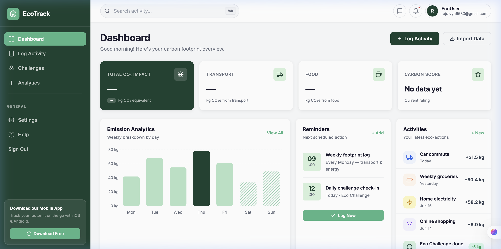

<div align="center">

# 🌿 EcoTrack

### Carbon Footprint Awareness Platform

**Track your impact · Reduce your emissions · Build sustainable habits**

[](https://python.org)
[](https://flask.palletsprojects.com)
[](https://firebase.google.com)
[](https://leafletjs.com)
[](https://chartjs.org)
[](LICENSE)

<br/>

### 🔗 [**Live Demo → ecotrack-flask-app.vercel.app**](https://ecotrack-flask-app.vercel.app)

[](https://ecotrack-flask-app.vercel.app)

<br/>



</div>

---

## 📋 Table of Contents

- [About](#-about)
- [New Features & Updates](#-new-features--updates)
- [Tech Stack](#-tech-stack)
- [Project Structure](#-project-structure)
- [Getting Started](#-getting-started)
- [Testing](#-testing)
- [Deployment](#-deployment)
- [AI Engine (EcoBot)](#-ai-engine-ecobot)
- [API Reference](#-api-reference)
- [Carbon Calculation Logic](#-carbon-calculation-logic)
- [Security & Architecture](#-security--architecture)
- [Roadmap](#-roadmap)
- [License](#-license)

---

## 🌍 About

Individual lifestyle choices account for roughly **20–30% of total greenhouse gas emissions** in developed economies. Most people lack an accessible, personalised tool to understand their specific carbon impact.

**EcoTrack** bridges this gap — a full-stack SPA (live at **[ecotrack-flask-app.vercel.app](https://ecotrack-flask-app.vercel.app)**) that helps users:

- 📊 **Calculate** their carbon footprint across 4 lifestyle categories
- 📈 **Visualise** weekly emission trends and monthly goal progress
- 🤖 **Interact** with **EcoBot**, an AI assistant offering personalised tips
- 🗺️ **Map** their emission hotspots and discover local eco-friendly "Green Spots"
- 🏆 **Complete** daily & weekly eco-challenges to build sustainable habits
- 📲 **Install** the app locally as a Progressive Web App (PWA)

---

## 🚀 New Features & Updates

EcoTrack has recently undergone a massive overhaul with a **"Donezo"-inspired Design System**, upgrading the platform to a modern, responsive, and highly interactive experience.

### 🎨 Visual & UI Upgrades
- **Donezo Visual System**: Beautiful Dark Forest green primary (#1B4332), light green accent (#52B788), pure white cards with soft shadows, and clean Inter typography.
- **Dark Mode**: Integrated light/dark theme toggle saving user preference locally.
- **Dynamic Dashboard**: Interactive Chart.js charts, Carbon Timer, daily reminders, and team collaboration views.
- **Notifications Hub**: In-app notifications and announcements panel.

### 🧠 EcoBot AI Assistant
- Floating chat widget accessible from any page.
- Backed by a **Groq API** (Llama-3-8b) primary engine with **Ollama** local fallback.
- Context-aware answers: It uses your actual footprint data and name to provide targeted eco-coaching.

### 🗺️ Eco Map
- Integrated **Leaflet.js** map to visualise logged transport routes.
- **Heatmap Layer**: Spot areas where you generate the most emissions.
- **Green Spots Layer**: Discover nearby EV charging stations, recycling centres, and bike rentals using the OpenStreetMap API.
- Geocoding support to draw routes visually by entering city names.

### ⚙️ Enhanced Modules
- **Settings**: Manage profile info, notification preferences, and monthly carbon goals. Includes a "Danger Zone" account deletion flow.
- **Import Data**: Drag-and-drop CSV importer with server-side duplicate prevention and validation to easily backfill your footprint history.
- **Help Center**: Interactive FAQ, video tutorial links, keyboard shortcuts list, and support ticket system.
- **PWA Ready**: `manifest.json` and `service-worker.js` provide offline capability and home-screen installation.

---

## 🛠️ Tech Stack

### Backend
| Technology | Purpose |
|---|---|
| **Python 3.12** | Runtime |
| **Flask 3.0** | Web framework + REST API |
| **Gunicorn** | Production WSGI server |
| **Groq / Ollama / Gemini** | AI Agents & Tip generation |
| **Flask-Limiter** | Rate limiting for API stability |
| **Flask-CORS** | Cross-origin request handling |
| **Firebase Admin SDK** | Server-side Firestore operations |
| **Pytest / pytest-cov** | Unit & integration testing, coverage |

### Frontend
| Technology | Purpose |
|---|---|
| **Vanilla JS (ES6)** | SPA routing, modular architecture |
| **Vanilla CSS** | "Donezo" style design system, Dark Mode support |
| **Chart.js 4.4** | Activity charts and goal donuts |
| **Leaflet.js + Heatmap** | Interactive maps and geo-visualisation |
| **Service Workers** | Progressive Web App capabilities |

### Infrastructure
| Technology | Purpose |
|---|---|
| **Firebase Auth** | Secure Email/Password authentication |
| **Firebase Firestore** | NoSQL database for footprints, settings, notifications |
| **Firebase Hosting** | Static asset delivery |
| **Render** | Primary production deployment (Gunicorn + `render.yaml`) |
| **Vercel** | Alternative serverless Python deployment (`vercel.json`) |

---

## 📁 Project Structure

```
EcoTrack/
├── app.py                    # Flask application factory
├── config.py                 # Configuration loader (Dev/Prod)
├── requirements.txt          # Python dependencies
├── runtime.txt                # Python runtime version pin (Render)
├── Procfile                  # Gunicorn start command (Render/Heroku-style)
├── render.yaml                # Render deployment + env var manifest
├── vercel.json                # Vercel serverless deployment config
├── firebase.json              # Firebase Hosting config
├── .firebaserc                 # Firebase project alias
├── .env.example               # Environment variables template
├── api/
│   ├── routes.py             # Flask Blueprint for all REST APIs
│   ├── calculator.py         # CO₂ calculation logic + Error handling
│   ├── tips.py               # Gemini tips integration
│   └── challenges.py         # Gamification challenges dataset
├── templates/
│   └── index.html            # Main SPA shell (Injects Firebase config)
├── static/
│   ├── manifest.json         # PWA Manifest
│   ├── service-worker.js     # PWA Service Worker for offline support
│   ├── css/
│   │   ├── styles.css        # Main layout & component styles
│   │   ├── dark-mode.css     # Dark mode overrides
│   │   ├── ecobot.css        # AI chat widget styles
│   │   └── map.css           # Leaflet map container styles
│   └── js/
│       ├── app.js              # Core SPA Router and App initialization
│       ├── auth.js             # Firebase Auth logic
│       ├── firebase-config.js  # Firebase Web SDK initialization
│       ├── firestore.js        # Core Firebase data operations
│       ├── calculator.js       # Client-side footprint calculator UI
│       ├── dashboard.js        # Dashboard view logic
│       ├── dashboard-ui.js     # Chart.js rendering & dashboard widgets
│       ├── charts.js           # Chart.js helpers & datasets
│       ├── insights.js         # Trends & insights rendering
│       ├── challenges.js       # Gamification challenges UI
│       ├── ecobot.js           # Chatbot client logic
│       ├── map.js              # Leaflet map rendering & layers
│       ├── settings.js         # User preferences & account management
│       ├── import.js           # CSV bulk data import
│       ├── help.js             # FAQ search and support ticketing
│       └── notifications.js    # Notifications and announcements polling
├── tests/
│   ├── conftest.py            # Pytest fixtures (app, mock Firebase, etc.)
│   ├── test_api.py            # API route tests
│   ├── test_calculator.py     # Carbon calculation unit tests
│   ├── test_routes_firestore.py # Firestore-backed route integration tests
│   └── test_validation.py     # Input validation tests
└── docs/
    ├── screenshot-dashboard.png
    └── screenshot-login.png
```

---

## 🚀 Getting Started

### Prerequisites

- **Python 3.10+**
- **Firebase Project**:
  - Authentication (Email/Password) enabled
  - Firestore Database created
- **Groq API Key** (for EcoBot AI)
- **Gemini API Key** (for Tips generation)

---

### 1 — Clone the repo

```bash
git clone https://github.com/Divyaraj0001-design/EcoTrack.git
cd EcoTrack
```

### 2 — Virtual Environment & Dependencies

```bash
python3 -m venv .venv
source .venv/bin/activate  # Windows: .venv\Scripts\activate
pip install -r requirements.txt
```

### 3 — Environment Configuration

```bash
cp .env.example .env
```
Fill in the values in `.env`:
```env
FLASK_SECRET_KEY=your-secret-key
FLASK_ENV=development

# Firebase Client config
FIREBASE_API_KEY=...
FIREBASE_AUTH_DOMAIN=...
FIREBASE_PROJECT_ID=...
FIREBASE_STORAGE_BUCKET=...
FIREBASE_MESSAGING_SENDER_ID=...
FIREBASE_APP_ID=...

# Firebase Admin SDK (Local Path)
GOOGLE_APPLICATION_CREDENTIALS=serviceAccountKey.json

# AI APIs
GEMINI_API_KEY=...
GROQ_API_KEY=...
```

### 4 — Start the Server

```bash
flask run --port 5001
```

The production app is hosted on Vercel — visit the live deployment at **[ecotrack-flask-app.vercel.app](https://ecotrack-flask-app.vercel.app)**.

---

## 🧪 Testing

The test suite uses **Pytest** with mocked Firebase/Firestore fixtures so tests run without live credentials.

```bash
pytest                     # run the full suite
pytest --cov=api --cov=app # run with coverage report
```

Test files live in [tests/](tests/):
- `test_api.py` — API route smoke tests
- `test_calculator.py` — carbon calculation unit tests
- `test_routes_firestore.py` — Firestore-backed route integration tests
- `test_validation.py` — input validation tests

---

## ☁️ Deployment

EcoTrack ships with config for two deployment targets:

### Render (recommended)
- `render.yaml` defines the web service, build/start commands, and required env vars.
- `Procfile` and `runtime.txt` pin the Gunicorn start command and Python version.
- Push to a connected GitHub repo and Render builds/deploys automatically using `gunicorn app:app`.

### Vercel — **currently live** 🟢
- **Live URL:** [https://ecotrack-flask-app.vercel.app](https://ecotrack-flask-app.vercel.app)
- `vercel.json` configures `app.py` to run as a Python serverless function via `@vercel/python`.
- Run `vercel` from the project root, or connect the repo in the Vercel dashboard for automatic deploys on push to `main`.

In both cases, set the same environment variables from `.env.example` (Firebase config, `GROQ_API_KEY`, `GEMINI_API_KEY`, etc.) in the platform's dashboard/secrets — `serviceAccountKey.json` should be uploaded as a secret file or its contents set via an env var rather than committed.

---

## 🤖 AI Engine (EcoBot)

The `/api/ecobot` endpoint implements an advanced cascade system to ensure maximum uptime:
1. **Groq API**: High-speed cloud inference using `llama-3.1-8b-instant`.
2. **Ollama**: Local fallback to `llama3` if Groq fails or rate-limits.
3. **Rule-Based Engine**: Safe local fallback if both AI models are unavailable.

EcoBot receives the user's name, recent footprint data (Transport, Food, Energy, Shopping), and monthly goal inside the system prompt to deliver highly contextual responses.

---

## 📡 API Reference

Endpoints are rate-limited and prefixed with `/api`.

- `GET /api/health`: Health check (used by uptime monitors / load balancers).
- `POST /api/calculate`: Calculate emissions and save to Firestore.
- `GET /api/history`: Fetch user's historical footprint entries.
- `GET /api/tips`: Fetch personalized Gemini AI suggestions based on emission categories.
- `GET /api/challenges`: Retrieve daily & weekly challenges.
- `POST /api/ecobot`: Send messages to the AI assistant.
- `POST /api/import`: Upload CSV footprint data (requires `multipart/form-data`).
- `POST /api/support-ticket`: Submit a help center request.
- `POST /api/notifications/mark-read`: Mark a user's notifications as read.

---

## 🧮 Carbon Calculation Logic

Emission factors sourced from **UK DEFRA 2023**.

| Category | Item | Factor |
|---|---|---|
| **Transport** | Car | `0.210 kg CO₂e / km` |
| | Flight | `0.255 kg CO₂e / km` (includes radiative forcing) |
| **Food** | Meat Diet | `7.20 kg CO₂e / day` |
| | Vegan Diet | `2.90 kg CO₂e / day` |
| **Energy** | Electricity | `0.233 kg CO₂e / kWh` |
| | Gas | `2.040 kg CO₂e / m³` |

Scores below 150 kg/mo are considered **Good/Excellent**, while scores above 300 kg/mo are flagged as **High Impact**.

---

## 🔒 Security & Architecture

- **Stateless API Backend**: Flask operates entirely as an API for the vanilla JS frontend.
- **Secure Firebase Config**: API keys for Firebase Web SDK are injected dynamically via Jinja2 into the SPA shell, preventing hardcoding in static files.
- **Rate Limiting**: `Flask-Limiter` protects AI and calculation endpoints to prevent abuse.
- **Service Account Isolation**: `serviceAccountKey.json` is excluded from Git to prevent backend credential leaks.

---

## 🗺️ Roadmap

- [x] **Gemini & Llama AI integration** — Personalized tips and full chatbot integration.
- [x] **Eco Map** — Visual geographic tracking and eco-location discovery.
- [x] **PWA** — Service worker caching and installability.
- [x] **Data Import** — CSV bulk uploading capabilities.
- [ ] **Real-time Team Sync** — Connect colleagues via Firebase Realtime Database.
- [ ] **Social Sharing** — Generate shareable badges.
- [ ] **Carbon Offsets** — Direct integration with verified offset providers.

---

## 📄 License

This project is licensed under the **MIT License** — see the [LICENSE](LICENSE) file for details.

---

<div align="center">
Made with 🌿 for a greener planet
</div>
